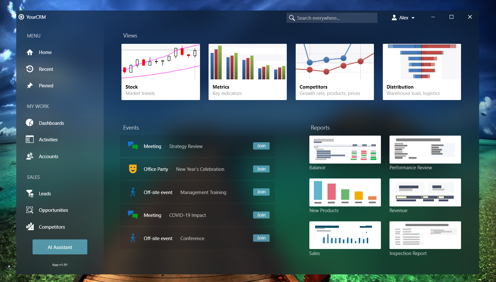

# How to Create a Unique Design for a WPF View using Appearance Options

This example demonstrates how to create the following view with DevExpress components:




Here are the main controls used in the view:
1. [ThemedWindow](https://docs.devexpress.com/WPF/DevExpress.Xpf.Core.ThemedWindow) - the window with the acrylic effect 
2. [AccordionControl](https://docs.devexpress.com/WPF/118347/controls-and-libraries/navigation-controls/accordion-control) - the navigation control on the left
3. [MainMenuControl](https://docs.devexpress.com/WPF/DevExpress.Xpf.Bars.MainMenuControl) with [bar items](https://docs.devexpress.com/WPF/6553/controls-and-libraries/ribbon-bars-and-menu/bars/populating-bars/items-and-links) - the user menu in the top right corner
4. [ListBoxEdit](https://docs.devexpress.com/WPF/DevExpress.Xpf.Editors.ListBoxEdit) - the galleries in the main part
5. [ButtonEdit](https://docs.devexpress.com/WPF/DevExpress.Xpf.Editors.ButtonEdit) - the search field in the window header


We used the following features to achieve this design:
1. [Acrylic effect](https://docs.devexpress.com/WPF/401394/common-concepts/fluent-design-support#acrylic-window-background)
```csharp
<dx:ThemedWindow AcrylicOpacity="0.6" AcrylicColor="#FF02111D" ... 
```
2. [Reveal highlight effect](https://docs.devexpress.com/WPF/401394/common-concepts/fluent-design-support#reveal-highlight)
```csharp
<Style x:Key="accordionChildItemStyle" TargetType="{x:Type dxa:AccordionItem}">
    <Setter Property="dxwui:RevealHighlightOptions.Mode" Value="BackgroundAndBorder"/>
    <Setter Property="dxwui:RevealHighlightOptions.BackgroundColor" Value="#19E4D9D9"/>
    <Setter Property="dxwui:RevealHighlightOptions.BorderColor" Value="#FF615B5B"/>
    <Setter Property="dxwui:RevealHighlightOptions.BorderThickness" Value="1"/>
</Style>
```

3. [Theme palettes](https://docs.devexpress.com/WPF/400728/common-concepts/themes/palettes) to customize theme colors:
```csharp
var custompalette = new ThemePalette("CustomPalette");
custompalette.SetColor("Foreground", Colors.White);
custompalette.SetColor("Focused", (Color)ColorConverter.ConvertFromString("#A04B647A"));
custompalette.SetColor("HoverBackground", (Color)ColorConverter.ConvertFromString("#1FFFFFFF"));
//… 
var customtheme = Theme.CreateTheme(custompalette, Theme.Office2019Black);
Theme.RegisterTheme(customtheme);
ApplicationThemeHelper.ApplicationThemeName = customtheme.Name;
```
4. [SVG image palettes](https://docs.devexpress.com/WPF/120131/common-concepts/images/svg-images#svg-image-palettes):
```csharp
<dx:WpfSvgPalette.Palette>
    <dx:WpfSvgPalette>
        <SolidColorBrush x:Key="Blue" Color="White"/>
        <SolidColorBrush x:Key="Black" Color="White"/>
        <SolidColorBrush x:Key="Yellow" Color="White"/>
        <SolidColorBrush x:Key="Red" Color="White"/>
        <SolidColorBrush x:Key="Green" Color="White"/>
    </dx:WpfSvgPalette>
</dx:WpfSvgPalette.Palette>
```

5. [SimpleButtons](https://docs.devexpress.com/WPF/DevExpress.Xpf.Core.SimpleButton) with a corner radius:
```csharp
<dx:SimpleButton CornerRadius="2" 
```
6. The [ThemedWindow.HeaderItems](https://docs.devexpress.com/WPF/DevExpress.Xpf.Core.ThemedWindow.HeaderItems) property to add elements to the window header.
